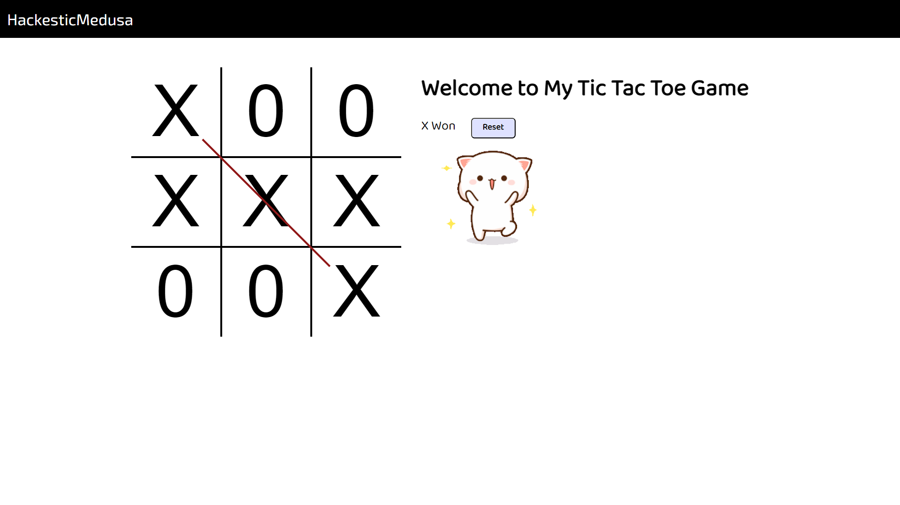

# Tic Tac Toe Game

## Overview
Tic Tac Toe is a classic two-player game where players take turns marking spaces on a 3x3 grid with their symbol, either an X or an O. The first player to get three of their symbols in a row, column, or diagonal wins the game.

## Screenshot

## How to Play
To play the game, simply click on an empty space on the grid to mark it with your symbol. The game will automatically switch turns between players. Keep playing until one player wins or the game ends in a draw.

## Features
- Two-player gameplay
- Interactive grid for marking spaces
- Win detection and end-of-game messages
- Compatible with PCs, mobile devices, and tablets
- Built using HTML, CSS, and JavaScript
- Includes background music and a cute winning GIF